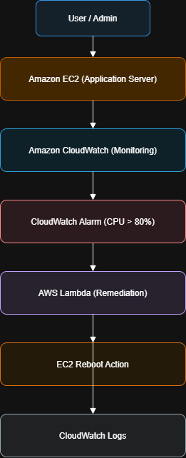
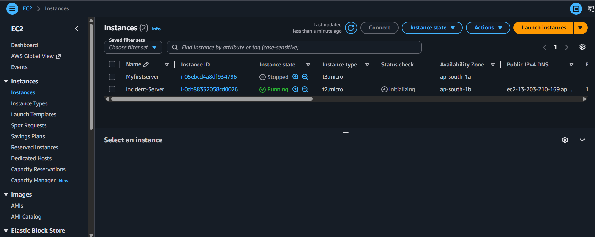
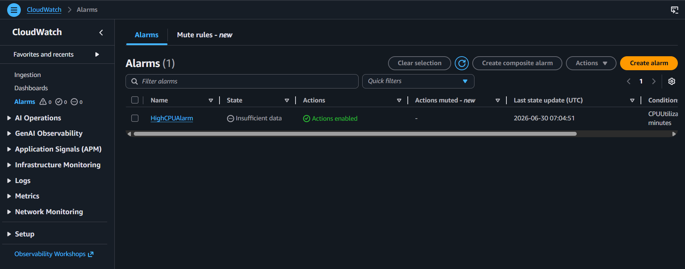
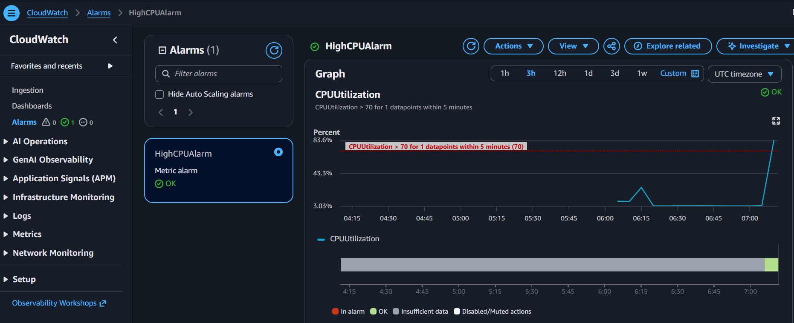
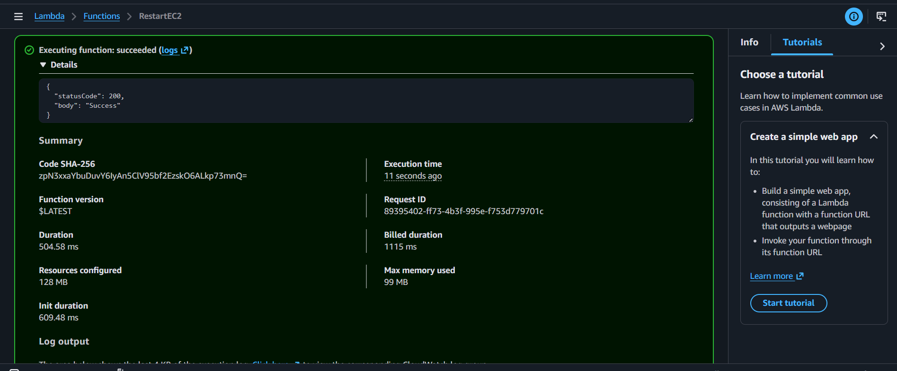
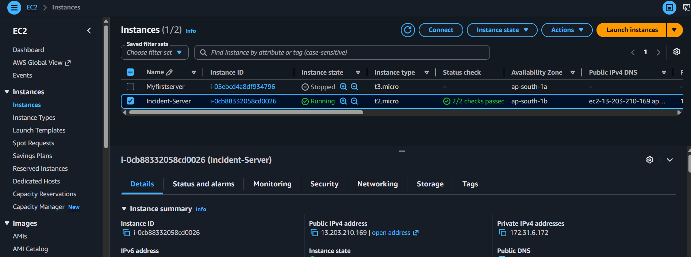
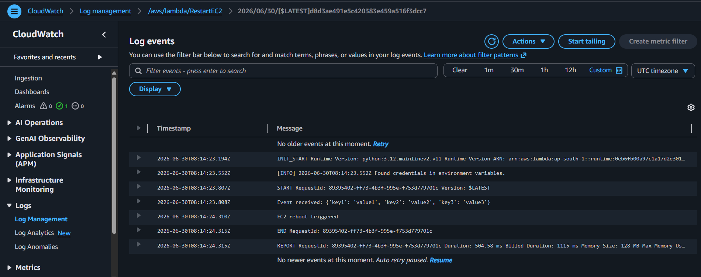

# 🚀 Automated Incident Response System using Amazon CloudWatch & AWS Lambda


---

## 📌 Project Overview


This project demonstrates an **event-driven automated incident response system** using AWS services. It continuously monitors an Amazon EC2 instance using **Amazon CloudWatch** and automatically triggers remediation using **AWS Lambda** when CPU utilization exceeds a defined threshold.

The system ensures **high availability, reduced downtime, and automated recovery without manual intervention**.

---

## 🏗 Architecture

```
EC2 Instance → CloudWatch Metrics → CloudWatch Alarm → AWS Lambda → EC2 Reboot → CloudWatch Logs
```

<p align="center">
  
</p>
---

## 🎯 Problem Statement

Production systems may experience high CPU usage leading to performance degradation or downtime. Manual monitoring increases response time and operational effort.

This project automates detection and remediation to solve this issue.

---

## 🎯 Objectives

- Monitor EC2 CPU utilization
- Detect threshold breach automatically
- Trigger AWS Lambda function
- Reboot EC2 instance automatically
- Maintain logs in CloudWatch
- Reduce manual intervention

---

## ✨ Key Features

- Real-time monitoring using CloudWatch
- Automatic incident detection
- Serverless remediation using Lambda
- EC2 auto-restart capability
- Centralized logging
- Event-driven architecture
- Reduced downtime (MTTR improvement)

---

## 🛠 AWS Services Used

| Service | Purpose |
|----------|---------|
| EC2 | Compute instance |
| CloudWatch | Monitoring metrics |
| CloudWatch Alarm | Threshold detection |
| AWS Lambda | Automation & remediation |
| IAM | Permissions |
| CloudWatch Logs | Logging |

---

## 📂 Project Structure

```
Automated-Incident-Response-System/
├── images/
│   └── architecture.png
│
├── lambda/
│   └── lambda_function.py
│
├── screenshots/
│   ├── ec2-instance.png
│   ├── cloudwatch-alarm.png
│   ├── high-cpu-utilization.png
│   ├── lambda-execution.png
│   ├── ec2-reboot.png
│   └── cloudwatch-logs.png
│
└── README.md

```

---

## ⚙ Implementation Steps

1. Launch EC2 instance  
2. Enable CloudWatch monitoring  
3. Create CPU utilization alarm (>70%)  
4. Create AWS Lambda function  
5. Attach IAM permissions  
6. Link alarm to Lambda trigger  
7. Generate CPU load using stress tool  
8. Verify automatic EC2 reboot  

---

## 📷 Screenshots

### EC2 Instance

---
### CloudWatch Alarm

---
### High CPU Utilization

---
### Lambda Execution

---
### EC2 Reboot

---
### CloudWatch Logs


---

## 📈 Results

- CPU spike successfully detected
- CloudWatch alarm triggered automatically
- Lambda executed without manual intervention
- EC2 instance rebooted successfully
- Logs stored in CloudWatch

---

## 🚀 Future Enhancements

- SNS email / Slack notifications
- Auto Scaling integration
- AWS Systems Manager automation
- Multi-instance monitoring
- EventBridge-based workflows

---

## 🧠 Key Learning

- AWS CloudWatch monitoring
- Event-driven architecture
- AWS Lambda automation
- EC2 management
- IAM role configuration
- Cloud operations best practices

---


## 🏁 Conclusion

This project demonstrates a fully automated incident response system using AWS serverless and monitoring services. It improves system reliability, reduces downtime, and removes manual intervention through intelligent cloud automation.